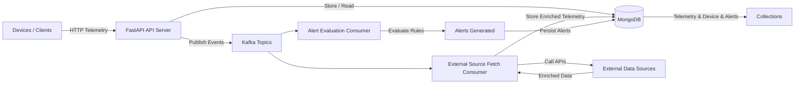

# Telemetry Processing System

1. What the system does

This system ingests device telemetry data, enriches it using external data sources, and evaluates alert rules in near real-time.

Core responsibilities:

- Accept telemetry data via HTTP APIs
- Store telemetry and metadata in MongoDB
- Publish events to Kafka for asynchronous processing
- Fetch data from external sources using Kafka consumers
- Validate alert rules against incoming telemetry and generate alerts

The system is designed to be event-driven, asynchronous, and scalable, separating API responsibilities from background processing.



2. How to run it

Prerequisites

- Python 3.10+
- MongoDB
- Kafka

a. if you have docker then to run kafka and mongodb you can use bellow docker commands

Start MongoDB
```bash
docker run --name localmongo --rm -d -p 27018:27017 mongo:latest
```

Start Kafka
```bash
docker run --name localkafka --rm -it -d -p 3181:3181 -p 3040:3040 -p 7081:7081 -p 7082:7082 -p 7083:7083 -p 7092:7092 --env ZK_PORT=3181 --env WEB_PORT=3040 --env REGISTRY_PORT=8081 --env REST_PORT=7082 --env CONNECT_PORT=7083 --env BROKER_PORT=7092 --env ADV_HOST=127.0.0.1 lensesio/fast-data-dev
```

Environment Variables

```bash
MONGODB_URI=mongodb://localhost:27017
DATABASE_NAME=anan_sky_db

KAFKA_BOOTSTRAP_SERVERS=localhost:7092
KAFKA_GROUP_ID=telemetry-consumer

MODE=server          # server | consumer
CONSUMER_TYPE=fetch_external_source  # or alert_evaluator
```

Run API Server

```bash
MODE=server uvicorn src.main:app --reload
```

Run Kafka Consumer

```bash
MODE=consumer CONSUMER_TYPE=fetch_external_source python src/main.py

# or

MODE=consumer CONSUMER_TYPE=alert_evaluator python src/main.py
```


## Run using Makefile

A Makefile is provided to simplify local development and execution of the system.

Available commands:

```bash
make help

# Displays all available Makefile targets.

# Install dependencies
make install

# Installs all Python dependencies from requirements.txt.

# Start API server
make server

# Runs the FastAPI server using Uvicorn on port 8001.

# Run Kafka consumers
# Run alert evaluation consumer
make consumer-alert

# Run external source fetch consumer
make consumer-fetch

# Run consumer by type
make consumer-run CONSUMER_TYPE=fetch_external_source

# Run simulators
# Simulate device telemetry
make device-sim

# Simulate external data source
make external-sim

# Start local dependencies (Docker)
# Start Kafka
make start-kafka

# Start MongoDB
make start-mongo

```

3. Key decisions made

- Single MongoDB client per process
  - Used a singleton Motor client to avoid connection overhead and ensure reuse across API routes and background consumers.

- Explicit database access (no ODM)
  - Database operations are handled via lightweight model classes instead of a full ORM/ODM to keep queries explicit and performant.

- Kafka for async processing
  - Time-consuming or non-critical work (external data fetch, alert evaluation) is handled asynchronously using Kafka consumers.

- Decoupled API and consumers
  - The API server and Kafka consumers can run independently, allowing horizontal scaling of each component.

- Schema validation at API boundary
  - Pydantic models are used to validate incoming data before it enters the system.

4. What I would improve or change in production

- Add MongoDB indexes and migrations for high-volume telemetry
- Implement dead-letter queues (DLQ) for failed Kafka messages
- Add observability (metrics, structured logging, tracing)
- Introduce authentication & authorization
- Add retry and backoff strategies for external API calls
- Separate database logic into a stricter Repository layer
- Add automated tests for consumers and alert evaluation logic
- Support schema versioning for telemetry payloads

